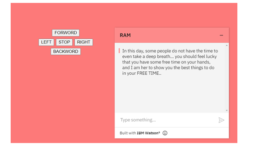

# CHATBOT
## Build a simple chatbot 
 I built a simple chatbot using IBM Watson, this chatbot help people to find a funny things to do in their free time. 
 Than Integrated with a web page.
 ## Simple user interface:

##  First message shown to the user:

 ## Trying the 'read'options:

 ## Trying the 'movie' options:

 ##  Trying the 'sport' options:

##  Now you can try my simple chatbot and see more: https://rama2428.github.io/IOT_Task3/
